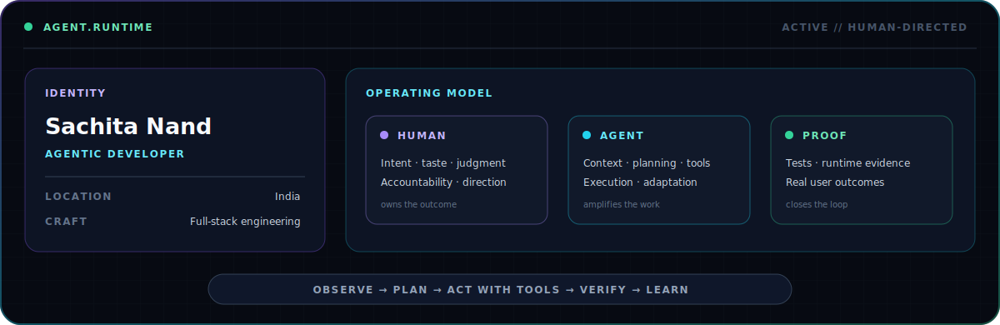
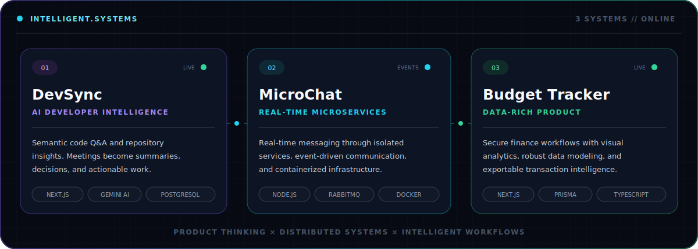
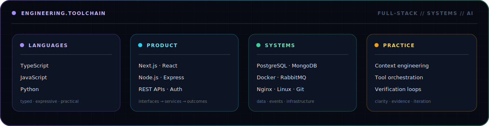

<!-- Profile README for github.com/Sachita007 -->

 

> I build software that can **understand context, choose a useful next action, use tools, and learn from the result**—with human judgment defining the goal and verification deciding when the work is done.

 

Context is the interface. Tools turn thought into work. Verification closes the loop.

 

 

 

<code>GITHUB.SIGNAL // PUBLIC ENGINEERING TRACE</code>

  

  

<code>HUMAN INTENT × MACHINE LEVERAGE × ENGINEERING DISCIPLINE</code>

  

**[Start a conversation](mailto:shachitanandk@gmail.com) · [Explore the systems](https://github.com/Sachita007?tab=repositories)**

