<!-- Profile README for github.com/Sachita007 -->

<div align="center">



<br />

<a href="mailto:shachitanandk@gmail.com"></a>
<a href="https://www.linkedin.com/in/sachita-nand-3a7558224"></a>
<a href="https://twitter.com/sachitan60"></a>
<a href="https://github.com/Sachita007?tab=repositories"></a>

</div>

> I build software that can **understand context, choose a useful next action, use tools, and learn from the result**—with human judgment defining the goal and verification deciding when the work is done.

## `agent.runtime`

```yaml
identity: Sachita Nand
role: Agentic Developer & Full-Stack Engineer
based_in: India

operating_model:
  human: intent, taste, judgment, accountability
  agent: context, planning, tool use, execution
  proof: tests, runtime evidence, user outcomes

current_signal: building adaptive agents and intelligent developer experiences
```

## `01 // flagship.agent` — Smart Guided Agent

<div align="center">

<a href="https://agent-seven-green.vercel.app">
  
</a>

</div>

### An agent that teaches software by guiding real actions—not by returning another help article.

A user describes a goal in natural language. The agent reads a compact snapshot of the interface, selects **one next action**, opens a click-through spotlight over the real control, observes the new screen state, and replans. The loop continues until the user's task is complete.

```text
USER INTENT
    │
    ▼
PERCEIVE UI ──► CHOOSE ONE ACTION ──► GUIDE REAL CLICK
    ▲                                      │
    └──────── OBSERVE + REPLAN ◄───────────┘
                         │
                         ▼
                   VERIFIED DONE
```

**Why it is agentic:** the walkthrough is authored at runtime from the interface state instead of replaying a fixed product tour. A scripted fallback keeps known flows useful when the model is unavailable.

`TypeScript` · `React` · `Vite` · `DOM reasoning` · `Adaptive planning` · `Human-in-the-loop`

**[Launch the live agent](https://agent-seven-green.vercel.app) · [Explore the architecture](https://github.com/Sachita007/agent)**

## `02 // agentic.engineering`

<table>
<tr>
<td width="33%" valign="top">

### Context is the interface

Give an agent the smallest accurate view of the world: repository state, interactive elements, constraints, history, and the user's real intent.

</td>
<td width="33%" valign="top">

### Tools turn thought into work

Connect reasoning to code, APIs, browsers, data, and specialized workflows. Orchestrate only where decomposition creates real leverage.

</td>
<td width="33%" valign="top">

### Verification closes the loop

An agent is not finished when it produces output. It is finished when the result works, evidence exists, and the user outcome is satisfied.

</td>
</tr>
</table>

<div align="center">

`OBSERVE` → `PLAN` → `ACT WITH TOOLS` → `VERIFY` → `LEARN`  
<sub>Repeat until the acceptance condition—not the prompt—is complete.</sub>

</div>

## `03 // intelligent.systems`

| System | Agentic or engineering signal | Stack |
|:--|:--|:--|
| **[Smart Guided Agent](https://github.com/Sachita007/agent)** · [Live](https://agent-seven-green.vercel.app) | Adaptive UI guidance that observes state and replans after each action | TypeScript · React · Vite |
| **[DevSync](https://github.com/Sachita007/DevSync)** · [Live](https://devsync.live) | Semantic code Q&A, repository intelligence, and meeting-to-action workflows | Next.js · Gemini AI · AssemblyAI · PostgreSQL |
| **[MicroChat](https://github.com/Sachita007/MicroChat)** | Event-driven real-time communication across containerized services | Node.js · RabbitMQ · Socket.io · MongoDB · Docker |
| **[Budget Tracker](https://github.com/Sachita007/Budget_Tracker)** · [Live](https://budget-tracker-kappa.vercel.app) | Secure product engineering, financial data workflows, and visual analytics | Next.js · TypeScript · PostgreSQL · Prisma |

## `04 // toolchain`

<div align="center">

[](https://skillicons.dev)

<br />

**Languages** `TypeScript` `JavaScript` `Python`  
**Product** `Next.js` `React` `Node.js` `Express`  
**Systems** `PostgreSQL` `MongoDB` `Docker` `RabbitMQ` `Nginx`  
**Practice** `API Design` `Context Engineering` `Tool Orchestration` `Verification Loops`

</div>

## `05 // github.signal`

<div align="center">
  
  
</div>

---

<div align="center">

### Have an ambitious product, an agent workflow, or a difficult system problem?

**[Start a conversation](mailto:shachitanandk@gmail.com) · [Explore the systems](https://github.com/Sachita007?tab=repositories)**

<br />

<code>human intent × machine leverage × engineering discipline</code>

</div>
